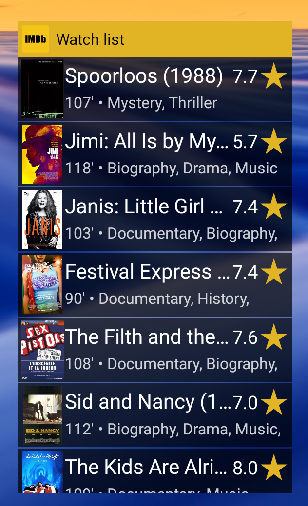
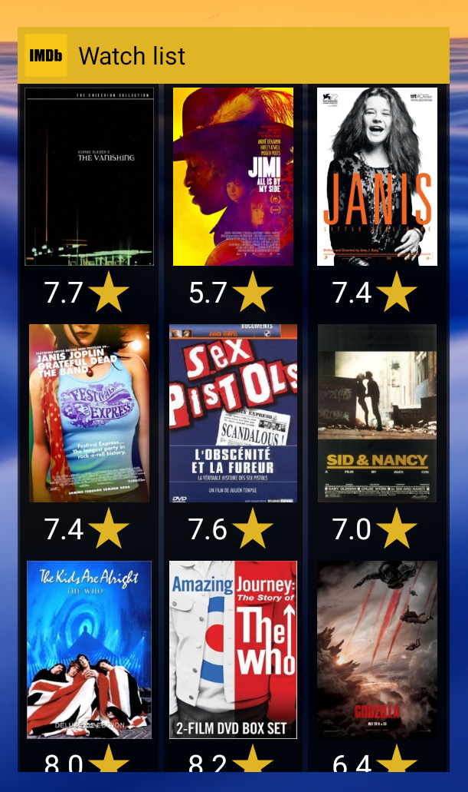

# Watchlist Widget

***An android app that beautifully displays your IMDB watchlist on a home screen widget!*** 

"Watchlist Widget" is a simple Android application that provides a home screen widget for your IMDB watchlist. A feature that the official IMDB app never supported and probably never will. In a few easy steps, you can have a scrollable widget to pick your next movie from, with posters, ratings and all. 

This app is heavily inspired by "[TV Time](https://www.tvtime.com/)" (formerly "TV Show Time"). Behind the scenes, it uses:

* [OMDB API](http://www.omdbapi.com/) for fetching posters. Read [below](#usage-instructions) how to get your free API key and specify it in the app 
* [Gllide](https://github.com/bumptech/glide) image loading and caching library
* [Expandable-fab](https://github.com/nambicompany/expendable-fab) library for a pumped up Floating Action Button (FAB)
* [OkHttp](https://square.github.io/okhttp/) library for fetching IMDB lists 

## Features

:white_check_mark: ​Link your IMDB Watchlist from it's URL or from a downloaded CSV file

:white_check_mark: Place a scrollable widget on your home screen (pics below)

:white_check_mark: Clicking titles brings you to the movie's IMDB page

:white_check_mark: Click the list header to open the app

:white_check_mark: Pull down the app's main app screen to manually refresh widget from tracked IMDB list 

| List Widget                 | Grid Widget                 | Stack Widget                   |
| --------------------------- | --------------------------- | ------------------------------ |
|  |  | :hourglass: ***Coming soon!*** |

## Usage Instructions

1. Download the latest APK from the [Releases](https://github.com/laripping/watchlist-widget/releases) tab 
2. "Allow untrusted sources" and install the app from your download folder
3. :warning: Remember to re-disable installing from untrusted sources!  
4. Launch the app and link your IMDB watchlist using one of the following ways:

   * Pointing it to the list's IMDB URL - to always have your list's latest version on your home screen :heavy_check_mark:
     :warning: Just make sure your list is public! [FAQ](https://help.imdb.com/article/imdb/track-movies-tv/watchlist-faq/G9PA556494DM8YBA#)
   * Importing a pre-exported CSV snapshot of the IMDB, saved on the device - this will not follow upstream changes :cry:   
5. To show movie posters on the widget, you can register for a free OMDB API key [here](http://www.omdbapi.com/apikey.aspx) and specify it in the app's settings

6. Place a widget on your screen and start scrolling! :popcorn::popcorn:

