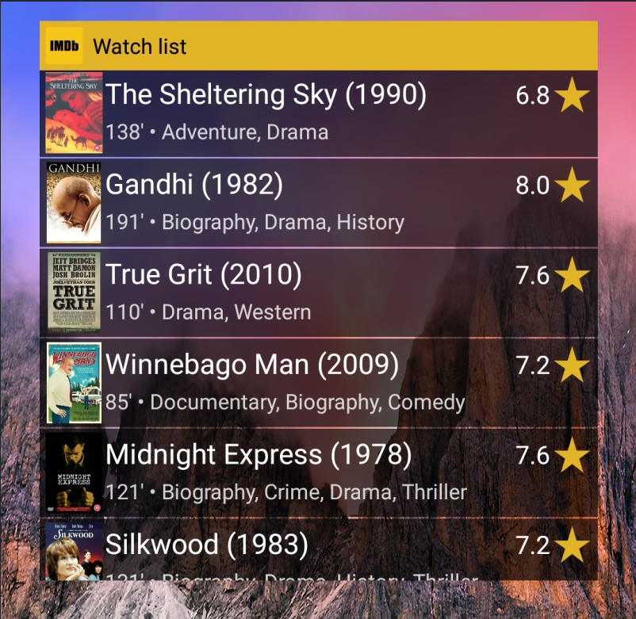

# Watchlist Widget

> An android app that beatifully displays a user's watchlist and has a home screen widget for it too! 

In every Android's I've ever owned, I would always make room in one of the home screens for movies, as a go-to place for when I want to chill and enjoy a film, populating it with all the relevant apps and widgets. What's always annoyingly missing is a cool widget to list my options and remind of good movies I've noted. Of course, like millions other users, I use my **IMDB** watchlist for this purpose... but the IMDB App doesn't offer a Widget to display any list.

This app aims to bridge that gap. Simplistic, and heavily inspired by "[TV Time](https://www.tvtime.com/)" (formerly "TV Show Time") - another excellent app (*which as of recently supports tracking Movies as well!*). It uses:

* [OMDB API](http://www.omdbapi.com/) for fetching posters, the [Usage Instructions](#usage-instructions) for instructions on how to get your free API key and bundle within the app 
* [Gllide](https://github.com/bumptech/glide) image loading and caching library
* [Expandable-fab](https://github.com/nambicompany/expendable-fab) library to pump up my Floating Action Button
* [OkHttp](https://square.github.io/okhttp/) library for fetching IMDB lists 


## Features

:white_check_mark: ​Importing IMDB Watchlist from downloaded CSV file

:white_check_mark: ​Pointing to a *public* IMDB Watchlist to track

:white_check_mark: Placing fancy, scrollable widgets on your home screen (pics below)

:white_check_mark: Clicking titles to get to the IMDB page

:white_check_mark: Pull down main app screen to manually refresh widget from tracked IMDB list 

| List Widget                 | Grid Widget                    | Stack Widget                   |
| --------------------------- | ------------------------------ | ------------------------------ |
|  | :hourglass: ***Coming soon!*** | :hourglass: ***Coming soon!*** |


### Disclaimers :warning:

This is a free time hobby, I'm not a dev - I'm a security consultant and while I'd like to see people using my app and maybe take a glimpse of the support lifecycle, take this repo as it is:

:x: Through the eyes of a proper dev, the **code is probably shit**

:x: Of course **it doesn't include tests**, nor unit nor regression no nothing

:x: It will by no means support many devices, hell, I've **only tried it in a Xiaomi Redmi 5 Plus**, and my own **Pixel 2**


## Usage Instructions

1. Clone the project and load into Android Studio

2. Register for a free OMDB API key [here](http://www.omdbapi.com/apikey.aspx)  - otherwise I'd need to do naughty stuff with the private IMDB API 

3. Place it in a file in the project root as below, named `apikey.properties`

   ```
   OMDB_KEY="XXXXXXXXX"
   ```

4. Build as usual and side-load to device (or just enable USB debugging)

5. Launch app and now you have 2 ways to add watchlist titles:

   * Export your IMDB watchlist as a CSV file, download to the device, and select it through the "Import" functionality
   * Make your IMDB watchlist public (by following the official IMDB guidance on the relevant [FAQ](https://help.imdb.com/article/imdb/track-movies-tv/watchlist-faq/G9PA556494DM8YBA#)) and provide the URL in the "Point to URL"  functionality

6. Place a widget on your screen and chill :popcorn::popcorn:


## Roadmap

- [ ] **About** ->
  - [ ] `AboutActivity` with Github link for updates, Version (/ commit hash + date)
  - [ ] <u>and release from GH</u> + instructions to install from unknown sources - but switch back off afterwards
- [x] Settings -> `SettingsActivity` 
  - [x] Auto-refresh interval - Subtitle: Last Refresh
  - [ ] Option to hide app icon
  - [x] Untrack list (greyed out if not tracking)
  - [ ] **Parameterized** OMDB API key + Field in `ConfigActivity` to receive it
- [ ] Styling
  - [ ] display a collage/tiling of titles' posters, below the Status ("Empty"/"N titles"), fading towards the FAB 
  - [ ] show List (Name?) currently traced
  - [ ] night theme doesn't work nice
- [ ] **Spinners and Loading TODOs**
  - [ ] That broken refresh animation
- [ ] TODOs and Error handling 
  - [ ] What happens to posters when API key reaches max?
  - [ ] Test case: multiple widgets?
- [ ] Security fixes
  - [ ] Encrypted Prefs to protect the user's watchlist (and OMDB key)
  - [ ] Provider permission
  - [ ] Permission (?) to launch `ConfigActivity`
- [ ] Implement different  [Widget types](https://developer.android.com/guide/topics/appwidgets/collections):
  - [x] List
  - [ ] Grid
  - [ ] Stack
  - [ ] Flipper

- [ ] Customise Night theme
- [ ] Larger display on larger screens (higher dpi?)
- [ ] Widget customisation?
- [ ] 
  End long titles in ...